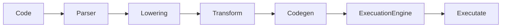
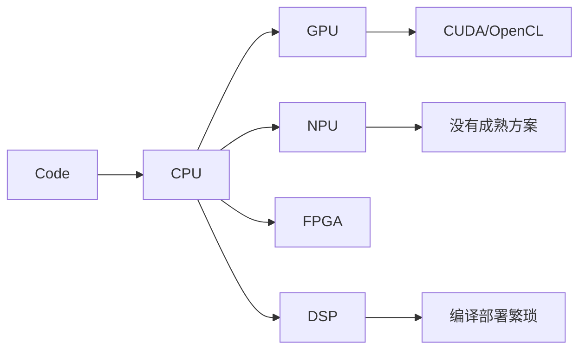
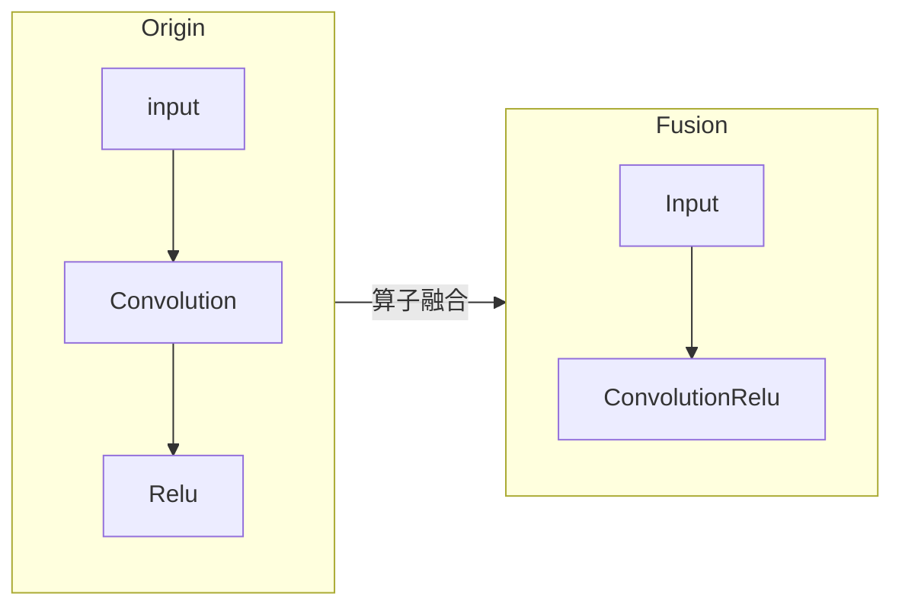
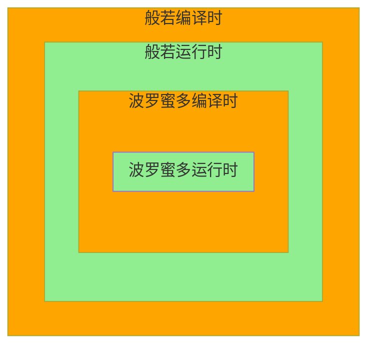
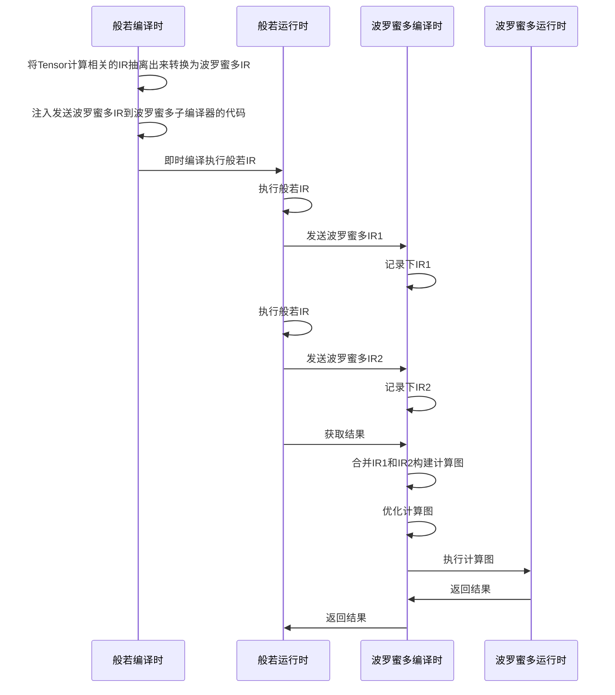

# 般若编程语言

般若编程语言是一门专注于高性能计算, 并行计算和异构计算的编程语言. 其由般若(主)编译器, 波罗蜜(子)编译器; 和服务于人工智能, 科学计算等相关基础设施构成. 般若希望可以改善人工智能领域的编程环境, 构建新一代的人工智能基础设施, 推动人工智能的创新. 下面会阐述般若编译器的一些特点.

## 让编程回归最初的样子

很多编程语言本身非常复杂, 笔者有十年的c++编程经验, 但也只掌握了点皮毛. 般若致力于让编程回归到最初的样子, 其类似于"C语言加上面向对象和模板的简单拓展". 般若编程语言会遵循"简单明了"的设计原则. "简单"是为了降低用户学习掌握该语言的难度; "明了"是为了避免歧义, 更有利于团队的协作. 般若不会实现, 诸如"引用", "函数重载", "模板元编程(部分模板特化)", "模式匹配", "宏", "常量表达式"等容易引起混淆和难于掌握的编程特性; 也不会把option, any, object等数据结构直接封装到语言层面. 般若会致力于成为完备易用的编程语言, 所以像lambda表达式, 枚举之类的特性后面会逐步加入. 般若的内存管理使用最简单纯粹的引用计数, 且只在需要时才增加计数.

下面是一个般若的代码示例, 更多的例子可参阅"tests/compiler/prajna_sources"目录.

```
func testMain(){
   var hello_world =  "Hello World!\n";
   hello_world.print();
}
```

为了更适合人工智能, 机器学习等领域的研发, 般若还提供命令行编程环境
```
>> "Hello, World!"
Hello, World!
>> 2 * 6
12
>>
```
目前支持命令行的语言大部分都是解释型的, 而般若采用的是即时编译. "即时编译"意味着般若编译器是跨架构的, 不管是是ARM, X86和RSIC-V架构, 对般若来说没区别, 都可以简单快速地部署执行代码.

<!-- ## 般若编译器的架构 -->


上图是般若编译器的执行流程图, 和般若项目的代码结构是完全对应的.
整个般若编译器的实现有着非常好的层次化和模块化, 非常适合用户去理解. 笔者认为编译器和编程是相辅相成的, 理解了编译器自然知道如何去编程, 掌握了编程语言也大概知道编译器该怎么实现. 如果编译器本身很混乱, 那么它的编程语言也会很混乱. 基于这样的认识, 般若编译器实现时遵循的核心原则是"尽可能简单",  这个和"简单明了"原则是相呼应的.


<!-- ## 演变式IR

很多项目都提到了多层次IR的重要性, MLIR和Rust都有多层次IR的概念, 笔者也深受启发. 演变式IR的本质就是多层次IR, 但不会有明显的界限.
 -->


## 支持异构计算



如上图所示, 我们把不同架构芯片组合而成的计算方式叫做异构计算.
不同于CUDA在C++上拓展GPU编程范式, 般若设计之初就把异构计算作为核心需求.

```
import gpu::launchKernel;

@kernel // 标注核函数
@target("nvptx") // 标注平台, 后期会移除
func myKernel(tensor: gpu::Tensor<i64, 1>){
    var thread_idx = gpu::threadIndex();
    var thread_idx_x = thread_idx[0];
    tensor.data[thread_idx_x] = thread_idx_x;
}

@test
func testKernel(){
    var size = 13;
    var gridShape = [1,1,1];
    var blockShape = [size, 1, 1];

    var shape = [size];
    // 创建一个gpu端的tensor
    var gpu_tensor = gpu::Tensor<i64, 1>::create(shape);

    // 核函数调用, 和CUDA一样的调用方式
    myKernel<<<gridShape, blockShape>>>(gpu_tensor);

    // 将gpu的tensor拷贝会主机
    var host_tensor = gpu_tensor.toHost();
    for i in 0 to size{
        testing::Assert(host_tensor.data[i] == i);
    }
}

```
上面是一段gpu的代码, 该代码和CUDA是高度相似的. 般若并非要做一个国产版的CUDA, 般若追求更加自然和统一异构计算编程范式. 下面是般若里更为简洁的gpu调用, 无需繁琐的核函数实现, 也无需CPU和GPU之间的数据传输, 这一切编译器会自动处理.

```
@test
func testMain(){
    var shape = [1000];
    var tmp_tensor = core::Tensor<i64, 1>::create(shape);

    @gpu // 标注后, 编译器会将tmp_tensor的内存拷贝到gpu, 并在gpu上执行下面的运算
    for i in 0 to shape[0]{
        tmp_tensor.data[i] = i;
    }
    // 运行完后, gpu的数据会自动拷贝的tmp_tensor上

    for i in 0 to shape[0] {
        testing::Assert(tmp_tensor.data[i] == i);
    }
}
```

除此之外, 各种AI加速器的可编程性也会作为我们的核心需求, 下面的章节我展示我们打算如何实现AI加速器的编程

<!-- 般若编译器适配各种架构的处理器 -->

## 波罗蜜多子编译器

在规划中, 我们会实现一个称作"波罗蜜多(Parami)"的子编译器, 该子编译器专用于神经网络加速器(其实也就是卷积和矩阵乘法为主的专业芯片)的优化.

```
@paramita
func convolution_depthwise_channel(Input: tensor, Kernel: tensor) {
    var Output:tensor = tensor::createByPrototype(Input);
    var H = Input.shape[0];
    var W = Input.shape[1];
    var KH = Kernel.shape[0];
    var KW = Kernel.shape[1];
    for h, w, kh, kw in H, W, KH, KW {
        // 典型的多面体表达式
        Output[h, w] = Output[h, w] + Input[h + kh, w + kw] * Kernel[kh,kw];
    }
    return Output;
}

@paramita
func convolution_depthwise(Input: tensor, Kernel: tensor) {
    var H = Input.shape[0];
    var W = Input.shape[1];
    var C = Input.shape[2];
    var KH = Kernel.shape[0];
    var KW = Kernel.shape[1];
    var Output: tensor = tensor::createByPrototype(Input);
    // 也是一个多面体表达式
    for c in C {
        var Input_c = Input[:, :, c];
        var Kernel_c = Kernel[:, :, c];
        var Output_c = Output[:, :, c];
        // 调用多面体的子表达式, 般若认为表达式也应该由多个子模块构成, 然后再由编译器组合在一起
        Output_c = convolution_depthwise_channel(Input_c, Kernel_c);
    }

    return Output;
}
```
上述代码显示了在波罗蜜多子编译器中分离卷积的预期实现(最终实现可能和广告有所出入). 请注意上面的代码是没有控制流的(这里的for是循环体,并非控制流), 没有控制流的编程范式是比较容易和AI加速器适配的. 波罗蜜多会主要基于"多面体优化技术", 实现全自动的优化. 像其他AI编译器一样, 波罗蜜多也会关注"算子融合","计算分块","内存重排"等优化


不同于现有的神经网络框架, 波罗蜜多融合算子后不会需要你再去实现一个"ConvolutionRelu"的算子, 这一切都会基于全自动的优化.

## 混合编译

上面我们提到了波罗蜜多子编译器, 般若编译器会像下图所示去使用它.



般若编译器会在运行中启动一个波罗蜜多子编译器, 一个显而易见的收益是般若运行时里的"变量"传入到波罗蜜多里后就会变为编译时的"常量", 这就能极大的提高了编译器的优化能力.



让我们再来分析Pytorch和Tensorflow的动态计算图和静态计算图. 动态图更加灵活, 能更好地和程序中的控制流(if,else,for等语句)配合; 而静态图比较死板, 但能很好地优化计算图, 提供高效的执行方式. 如上图所示, 般若通过混合编译的方式, 使运行时的动态图发送到波罗蜜多里变为了静态图, 经波罗蜜多优化后再执行. 所以我们的计算图在般若主编译器里是动态的, 在波罗蜜多子编译器中是静态的, 具备二者的优点.

既然获得了计算图, 后期我们也可以将"自动求导"乃至"符号计算"也加进去, 不同于目前优化集中在推理阶段, 波罗蜜多的优化对于训练推理来说是一视同仁的, 因为其都是计算图而已.

笔者认为人工智能不会完全由人工神经网络组成,  应该是 "人工神经网络" 和 "计算机经典数据结构及算法" 构成的混合体系. 二者是相辅相成的, 这和般若的混合编译机制是相呼应的.

## 般若编译器的优势

得益于上面的特点, 总结下般若编译器具备的优势

* 简单易学, 没有奇技淫巧
* 即时编译, 无需预编译成可执行程序, 跨平台跨架构
* 异构计算, 更加通用的编程范式, 完全释放AI加速器
* 多面体优化, 良好的计算图优化能力
* 混合编译, 动/静计算图无缝转换, 神经网络模型训练部署一体化

## 如何试用

现在还没有编写库管理和错误提示模块, 故目前还没法直接使用, 感兴趣的朋友可以先通过源码编译的方式感受一下

```bash
# 首先当然需要下载代码
git clone https://github.com/matazure/prajna.git
# 下载依赖库
./scripts/clone_submodules.sh
# 配置release版本的cmake, 如果想要使用gpu版本, 则需要在有cuda环境的机器里开启-DPRAJNA_WITH_GPU=ON.
./scripts/configure.sh release -DPRAJNA_WITH_GPU=OFF
# 编译代码
./scripts/build.sh release
# 运行测试
./scripts/test.sh release
```
由于没有库管理, 可以直接修改tests/compiler/prajna_sources里的源码进行试用.

英伟达GPU运行依赖CUDA环境, 需要提前安装. 此外还需要安装llvm的llc程序, 可以通过如下方式安装
```bash
cd build_release/third_party/llvm-project/llvm
make install
cd -
sudo cp -r build_release/install/* /usr
```


## 其他

目前我正式开发般若编译器有小半年时间了, 做完了大部分的编译器前端工作, 实现了GPU编程的核心功能, 波罗蜜多和混合编译完成了理论原型.  规划在2023年一季度发布预览版本, 敬请期待.

### 联系方式

有任何问题都可以通过微信"zhangzhimin-tju"联系我

### 寻求天使投资

目前般若由我独立开发并开源, 但后面也会有商业化的规划, 故在此寻求天使投资, 以便组建一个强有力的团队, 有意联系.

### 寻求合作

般若编译器需要芯片, 自动驾驶, 科学计算(如有限元)等领域的合作伙伴.

### 招聘实习生

招聘实习生三位, 本科及其以上学历, 最后一周能投入16个小时以上. 1. 具备一定的编程和数学基础 2. 对编译器和人工智能基础设施很有兴趣. 不必担心没有项目经验和相关基础, 很容易学的. 可以加微信直接投递简历, 主要涉及以下几个方向可供选择,
1. 编译器全栈, 编译器的前后端实现, 包括编语言的解析, IR优化, 代码生成等, 还有针对循环体的特别优化.
2. 软件全栈, 基于vscode, jupyter等开源项目的IDE开发, 科学计算等的可视化环境开发.
3. 科学计算全栈, 基于般若编程语言开发标准库, 线性代数库和神经网络库等.


