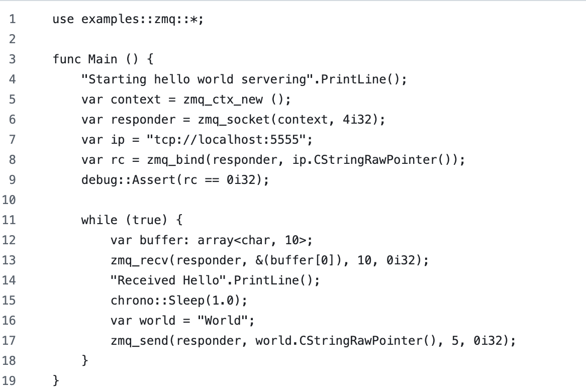
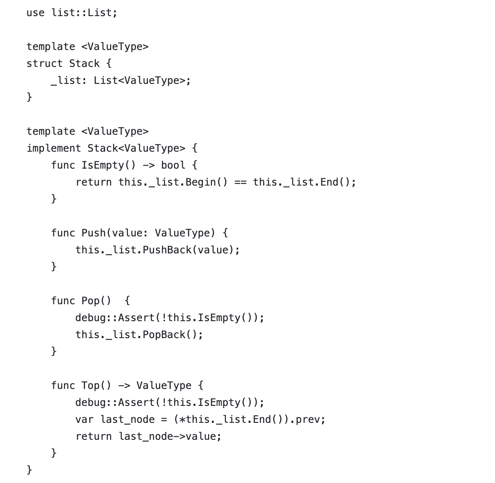
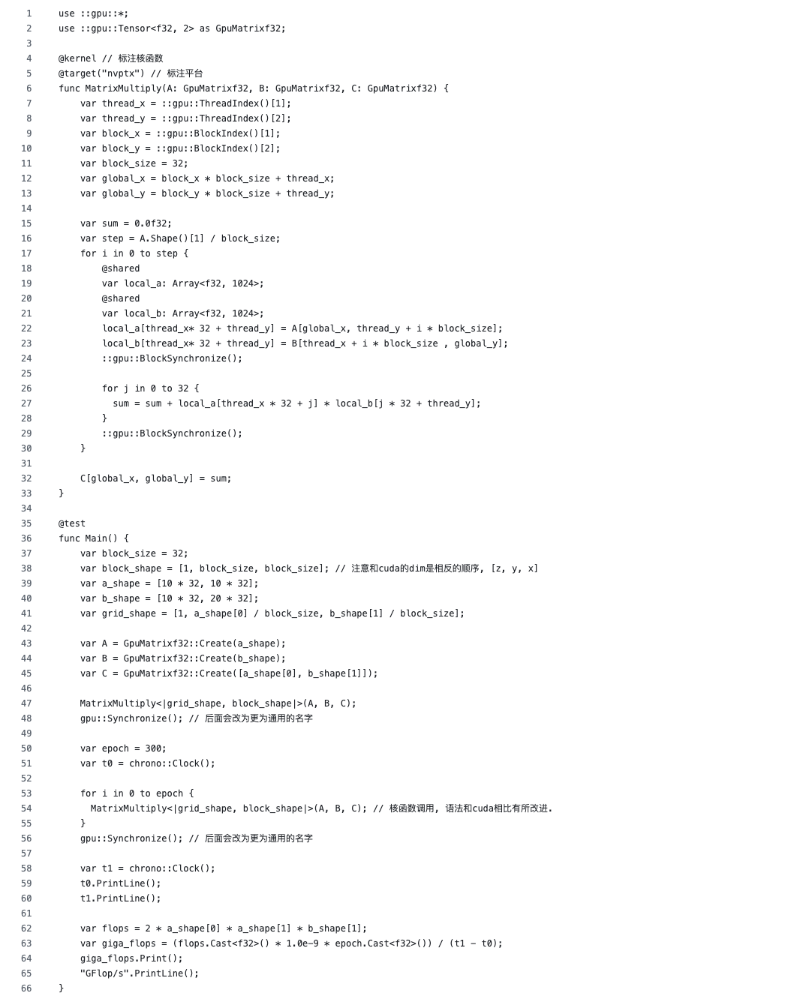

# Prajna Programming Language

[](https://github.com/ConvolutedDog/prajna/actions/workflows/Remote-Docker-Test.yml)
[](http://dev.matazure.com:8080/blue/organizations/jenkins/prajna/activity)

> [中文](README_ZH.md) | English

## What is Prajna?

<div>
    
</div>

Prajna is a statically typed general-purpose programming language developed by Xuanqing Matrix. It features concise syntax and efficient execution, aiming to combine Python’s flexibility with C++’s performance advantages.

Prajna supports Just-In-Time compilation (JIT), allowing cross-platform execution without building standalone binaries. It is currently compatible with LLVM ecosystem backends like NVVM and AMD GPU, and has built-in support for GPU parallel computing.

Prajna offers a strong static type system, modules and interface mechanisms, and automatic resource management (smart pointers), making it suitable for a wide range of applications from high-performance computing to system tools.

<div>
    
</div>

## Main Features

### Concise and Efficient Syntax Design

<div>
    
</div>

Prajna draws inspiration from modern programming languages, removing redundant syntax while maintaining clear semantics. It is easy to learn and write, suitable for system-level or high-performance code development.

<div>
    
</div>

### LLVM-based Backend

Prajna uses LLVM as its compilation backend, generating efficient native code. It currently supports LLVM ecosystem backends including NVVM and AMDGPU, fulfilling the needs of performance-critical applications.

#### Performance Benchmark Comparison

<div>
    
</div>

This program measures GB/s throughput by timing element-wise addition of two large 1D arrays each containing 1 billion `i32` elements. Benchmark code for each language is available [here](./assets/code/).

| Language | Throughput (GB/s) |
|----------|-------------------|
| Prajna   | 0.82              |
| Python   | 0.05              |
| C++      | 0.60              |
| Rust (opt-level=0) | 0.33       |
| Rust (opt-level=1) | 0.85       |

<div>
    
</div>

### Just-In-Time Compilation (JIT)

<div>
    
</div>

Prajna supports runtime JIT compilation, enabling execution of source code without building binaries. This is ideal for interactive development, scripting, and dynamic loading, while offering better performance than virtual machines.

<div>
    
</div>

### REPL and Debugging Support

### Just-In-Time Compilation (JIT)

<div>
    
</div>

The language provides an interactive REPL environment for quick and convenient usage, enhancing interactivity.

<div>
    
</div>

### Built-in Smart Pointer System

<div>
    
</div>

Prajna includes a built-in smart pointer `Ptr<T>`, which manages resource lifetimes automatically, preventing manual release errors. It also supports explicit release mechanisms, suitable for resource-sensitive scenarios.

<div>
    
</div>

### GPU Programming Abstractions

Prajna supports declaring GPU kernel functions directly using `@kernel` and `@target` annotations, managing GPU multi-dimensional arrays uniformly via the `Tensor` type. Thread and block indices can be accessed via `::gpu::ThreadIndex()` and `::gpu::BlockIndex()`, providing a CUDA-like parallel structure. It supports `@shared` variables for shared memory and `BlockSynchronize()` for thread synchronization.

<div>
    
    
    
</div>

## Documentation

For more details, please refer to the [Prajna Programming Language Guide](./docs/Prajna%20Programming%20Language%20Guide.md).

## Usage

Precompiled binaries are available for download on the releases page.

You can also pull a Docker image with Prajna preinstalled to try it out:

```bash
docker pull matazure/prajna:0.1.0-cpu-ubuntu20.04
docker run -ti matazure/prajna:0.1.0-cpu-ubuntu20.04 prajna repl
