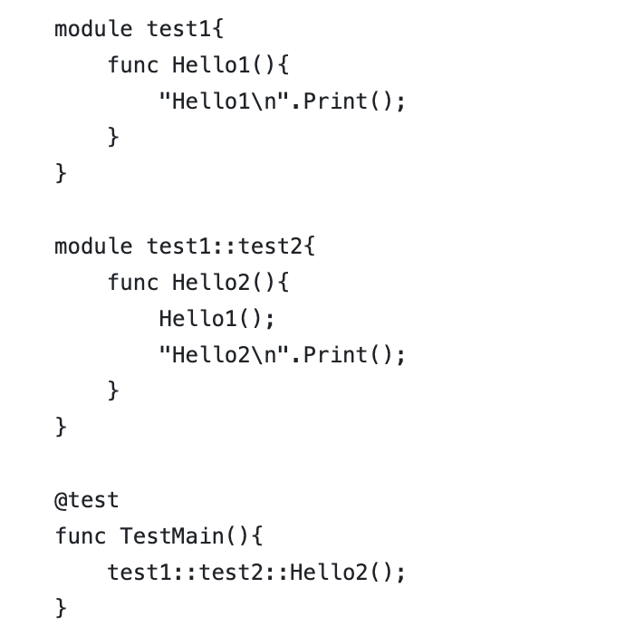

# Prajna Programming Language

[](https://github.com/ConvolutedDog/prajna/actions/workflows/Remote-Docker-Test.yml)
[](http://dev.matazure.com:8080/blue/organizations/jenkins/prajna/activity)

> [中文](README_ZH.md) | English

## What is Prajna?

<div>
    
</div>

Prajna is a statically-typed, general-purpose programming language developed by Matazure. It features a concise syntax and high runtime performance, aiming to combine the flexibility of Python with the efficiency of C++.

Prajna supports Just-In-Time (JIT) compilation, allowing cross-platform execution without building standalone binaries. It is compatible with X86, ARM, RISC-V, and other architectures, and has built-in support for GPU parallel computing.

Prajna features a strong static type system, modules and interface mechanisms, automatic resource management (smart pointers and weak references), as well as function pointers and a template system, making it suitable for building a wide range of applications from high-performance computing to system tools.

<div>
    
</div>

## Key Features

### Concise and efficient syntax design

<div>
    
</div>


  Prajna draws inspiration from modern programming languages, eliminating redundant syntax while maintaining clear semantics, making it easy to learn and write. It also supports advanced features such as function pointers and template metaprogramming, making it suitable for writing system-level or high-performance code.

<div>
  
</div>

### LLVM backend support

Prajna uses LLVM as its compilation backend to generate efficient native code. It supports multiple architectures (x86, ARM, RISC-V, etc.), meeting the demands of performance-critical applications.

### Just-In-Time (JIT) compilation

<div>
    
</div>

Prajna offers runtime JIT capabilities, allowing source code to be executed without building standalone binaries. This is well-suited for interactive development, scripting, and dynamic loading scenarios.

<div>
  
</div>

### REPL and debugging support

### Just-In-Time (JIT) compilation

<div>
    
</div>


 The language provides an interactive REPL environment for rapid testing and debugging. It also includes debugging assertions and error stack traces to improve development efficiency.

<div>
  
</div>

### Modular and interface system

Prajna features native `module` and `interface` constructs for flexible code organization, encapsulation, and reuse. Interfaces support static polymorphism, enabling the construction of type-safe generic libraries.

<div>
  
  
  
</div>


### Built-in smart pointer system

<div>
    
</div>

The language includes `Ptr<T>` smart pointers and `WeakPtr<T>` weak references to automatically manage resource lifecycles, avoiding memory errors from manual deallocation. It also supports explicit release mechanisms for resource-sensitive scenarios.

<div>
  
</div>


## Documentation

You can refer to the [Prajna Programming Language Guide](./docs/Prajna%20Programming%20Language%20Guide.md) to learn more.

## Usage

Compiled binary programs are available on the release page.

You can also directly download a Docker image with Prajna pre-installed to experience it:
```bash
docker pull matazure/prajna:0.1.0-cpu-ubuntu20.04
docker run -ti matazure/prajna:0.1.0-cpu-ubuntu20.04 prajna repl
```
