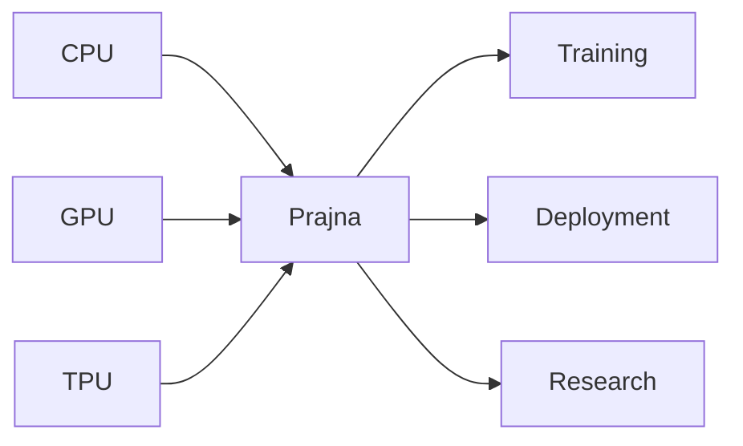
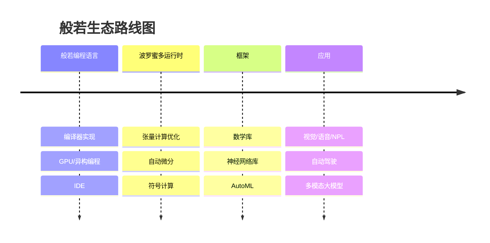
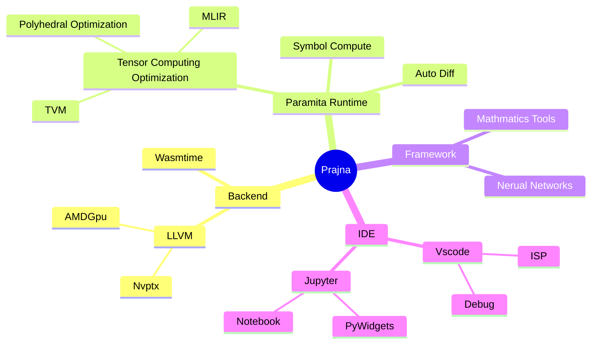

# 般若编程语言

般若是一门专门为构建更加模块化, 自动化和智能化的人工智能基础设施而研发的开源编程语言. 般若编程语言的目标是同时满足人工智能研究, 训练和部署等多个阶段的使用; 可以简易使用的CPU, GPU和各种TPU为人工智能提供算力.



## 人工智能基础设施现状

目前我们在建设人工智能基础设施时, 需要掌握C++, Python, CUDA和Triton等多门编程语言和技术, 这增加了软件开发的门槛和负担, 使得构建更加稳定和先进的人工智能基础设施尤为困难, 也阻碍了人工智能的进一步发展.

芯片行业研发了多种CPU, GPU, TPU和针对特定领域的加速卡, 这些处理器有着不同的硬件架构和软件生态, 进一步加剧了整个人工智能基础设施的碎片化.

对于人工智能基础设施$研发效率低$和$碎片化严重$的现状, 急需为人工智能基础设施专门设计一门编程语言, 围绕其重构我们的人工智能基础设施. 为此我们设计开发了般若编程语言.

## 般若语言特性

### 即时编译

般若采用即时编译方式,代码即程序, 无需事先编译为二进制可执行程序. 可以直接在X86, Arm和RiscV等各种指令集的芯片上直接运行. 采用LLVM作为后端, 所以会有着和C/C++一样的性能.

### GPU/异构编程

般若将同时提供对CPU, GPU和TPU的编程支持. 目前般若不止提供类似于CUDA的核函数编写, 还提供了gpu for等简单高效的并行编程范式, 会极大低降低异构/并行编程的复杂性. 后期会加大对各种芯片的支持力度

### 张量计算

般若后面会集成类型于MLIR和TVM的张量优化技术, 提供高效, 并行乃至分布式计算的支持. 把张量计算相关的并行计算, 分布式计算的支持放在底层, 会非常有利于后续神经网络等框架的开发.

### 语法改善

般若是属于类C语言, 借鉴Rust了的面向对象的设计(Swift), 移除不必要的语法特性, 例如引用等. 内存管理采用比较通用的引用计数.

### 友好交互

般若支持main函数, Repl和Jupyter等多种交互方式, 适合算法研发和部署等多种场景.

## 使用实例

下面展示的是一段在gpu上的运行的代码, 实现了在GPU上的张量加法. 我们可以看到在般若里, 只需要在for循环前面加一个"@gpu"的注解
, 编译器就会自动从CPU上拷贝数据到GPU, 在GPU上完成计算后又拷贝回到CPU上. 与CUDA的GPU编程相比, 般若同样的功能要简单很多.

```
import ::gpu;

func main(){
    var shape = [10, 20];
    var tensor0 = Tensor<i64, 2>::create(shape);
    var tensor1 = Tensor<i64, 2>::create(shape);
    var tensor2 = Tensor<i64, 2>::create(shape);

    for idx in [0, 0] to shape {
        tensor0.at(idx) = 1;
        tensor1.at(idx) = 2;
    }

    @gpu // 标注后, 会自动拷贝数据到gpu上
    for idx in [0, 0] to shape{
        tensor2.at(idx) = tensor0.at(idx) + tensor1.at(idx);
    }

    // 运行完后, gpu的数据会自动拷贝的主机上
    for idx in [0, 0] to shape{
        debug::assert(tensor2.at(idx) == 3);
    }
}
```

## 般若生态路线图

下面是般若及其相关生态的路线图, 作者粗略地分为了下面的四个阶段.



般若编程语言及其相关生态的建设是漫长和困难的. 般若编程语言的设计开发是整个生态的第一步, 也是最重要的一步, 目前已处于完善阶段.

## 般若相关技术

下图是一个般若会涉及到的相关技术思维导图, 重构人工智能基础设施并非把现有的东西全部否定, 恰恰相反现有的相关开源项目依然占据重要位置.
般若社区扮演的更多的是设计,整合和改善的角色. 比如编译的实现, 我们只会去设计编程语言的语法, 而编译器的后端会使用LLVM项目. 而第二阶段的张量计算优化, 我们初期会直接使用MLIR/TVM等项目. 在IDE方面, 我们会增加VSCode和Jupyter的支持. 正是得益于这些开源项目, 般若生态路线图才能稳固快速的推进.



## 重构后的人工智能基础设施是什么样

### 快速迭代, 提升效率

因为研究,训练,部署三个阶段都可以使用Prajna, 我们不需要再把模型从Pytorch中抽离出来, 也不需要把python代码转换为C++代码去部署. 这使得我们的研发,训练和部署流程可以更快的迭代.
Prajna本身改进了C++和Python的很多缺点, 也会使开发效率有所提升.

### 无需适配, 到处运行

不同于Pytorch和tensorflow在框架层去适配不同的硬件, Prajna会在编译层面去适配各种GPU和TPU. 甚至分布式计算也会由编译器完成工作,
这意味着Prajna的适配工作在编译器阶段就已经完成, 程序可以直接在CPU, GPU, TPU和集群上直接运行.

### 避免碎片化, 使TPU可编程化

目前很多芯片厂商都在以工具链的形式去适配Pytorch, Tensorflow和Jax等框架, 这除了工作量巨大之外还不具备可维护性.
而在般若生态里, 硬件厂商只需要适配类似LLVM的后端即可, 这部分工作本身也是不可避免的.

除此之外, 还能使TPU可编程化, 这也使得我们的TPU能应用到更多场景.

### 人工智能改善基础设施, 基础设施促进人工智能的发展

般若编译器有着非常清晰的模块和层次, 人工智能不止可以生成Prajna的代码, 还可以操作Prajna的中间表示, 选择编译器优化策略等.
这些都直接提升般若生态的能力, 般若生态的提升也会进一步促进人工智能的发展.

## 般若生态的其他影响

般若生态的本质是为算力提供简单高效的使用方式, 很多行业都会因此而受益. 例如:

* 科学计算
* 有限元分析
* 办公统计软件

## 与社区开发者关系

般若生态的建设需要社区开发者的大量参与, 般若生态会和开发者建立良好关系, 一起学习成长; 即使是编译器, 张量计算优化等关键技术, 般若生态也会和大家无私分享.

## 文档

可以查阅[般若编程语言指南](docs/般若编程语言指南.md)来进一步了解.

## 合作

作者联系方式

微信: zhangzhimin-tju

邮箱: zhangzhimin@matazure.com

项目本身还有很多问题, 需要组建一个团队才能克服, 故在此寻求种子轮天使投资, 期望更多志同道合的朋友加入.

对般若编程语言和人工智能基础设施感兴趣的朋友,可以加我微信进群.

如果有芯片, 自动驾驶, 科学计算等领域的朋友感兴趣, 欢迎一起探讨下如何展开合作.

招聘实习生, 本科及其以上学历, 最好一周能投入16个小时以上.可以加微信直接投递简历.
