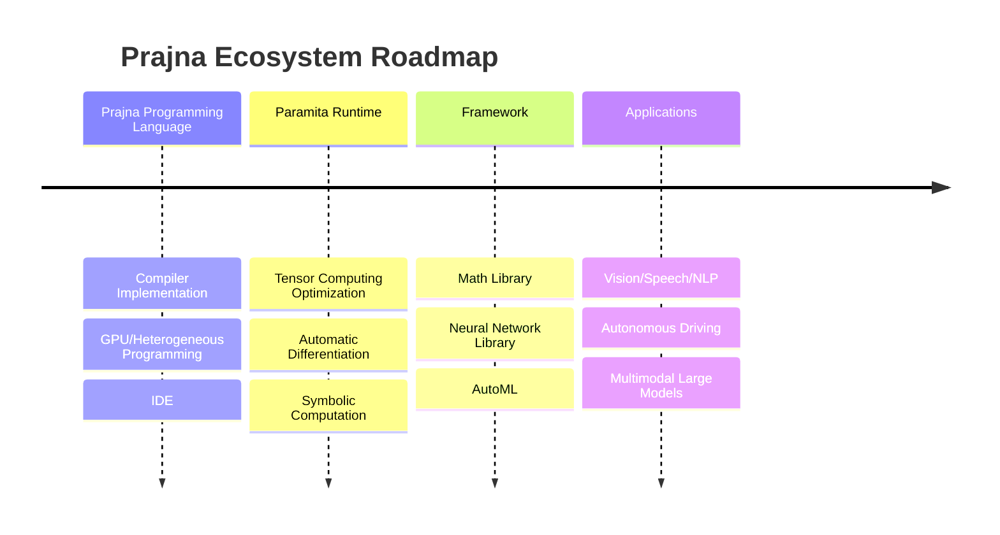
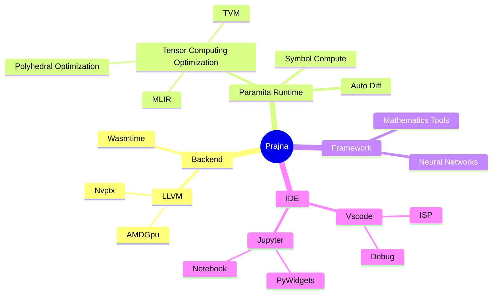

# Prajna Programming Language

[](https://github.com/ConvolutedDog/prajna/actions/workflows/Remote-Docker-Test.yml)
[](http://dev.matazure.com:8080/blue/organizations/jenkins/prajna/activity)

Prajna is an open-source programming language specifically developed for building more modular, automated, and intelligent AI infrastructure. The goal of the Prajna programming language is to meet the needs of AI research, training, and deployment in multiple stages; it provides easy-to-use support for CPUs, GPUs, and various TPUs to deliver computing power for AI.


## Current Status of AI Infrastructure

At present, building AI infrastructure requires proficiency in multiple programming languages and technologies such as C++, Python, CUDA, and Triton. This increases the development threshold and burden, making it particularly difficult to construct stable and advanced AI infrastructure, and hinders the further development of AI.

The chip industry has developed various CPUs, GPUs, TPUs, and domain-specific accelerators, all with different hardware architectures and software ecosystems, further aggravating the fragmentation of AI infrastructure.

Given the current situation of **low development efficiency** and **severe fragmentation** of AI infrastructure, it is urgent to design a programming language specifically for AI infrastructure and rebuild our AI infrastructure around it. For this reason, we have designed and developed the Prajna programming language.

## Features of Prajna Language

### Just-In-Time Compilation

Prajna uses just-in-time (JIT) compilation, where code is the program itself; there is no need to pre-compile into binary executables. It can run directly on chips with various instruction sets such as x86, ARM, and RISC-V. With LLVM as the backend, Prajna achieves performance comparable to C/C++.

### GPU / Heterogeneous Programming

Prajna provides programming support for CPUs, GPUs, and TPUs. It not only offers CUDA-like kernel function writing but also introduces high-level, efficient parallel programming paradigms such as gpu for, greatly reducing the complexity of heterogeneous/parallel programming. More hardware support will be added in the future.

### Tensor Computation

Prajna will later integrate tensor optimization technologies similar to MLIR and TVM, providing support for efficient, parallel, and even distributed computation. By placing parallel and distributed support for tensor computation at the underlying level, the development of frameworks such as neural networks will be greatly facilitated.

### Syntax Improvement

Prajna is C-like, borrowing object-oriented designs from Rust and removing unnecessary syntax features such as references. Memory management uses a common reference counting mechanism.

### Friendly Interaction

Prajna supports multiple interaction modes such as the main function, REPL, and Jupyter, making it suitable for various scenarios like algorithm development and deployment.

## Usage Example

```prajna
use ::gpu::*;
use ::gpu::Tensor<f32, 2> as GpuMatrixf32;

@kernel
@target("nvptx")
func MatrixMultiply(A: GpuMatrixf32, B: GpuMatrixf32, C: GpuMatrixf32) {
    var thread_x = ::gpu::ThreadIndex()[1];
    var thread_y = ::gpu::ThreadIndex()[2];
    var block_x = ::gpu::BlockIndex()[1];
    var block_y = ::gpu::BlockIndex()[2];
    var block_size = 32;
    var global_x = block_x * block_size + thread_x;
    var global_y = block_y * block_size + thread_y;

    var sum = 0.0f32;
    var step = A.Shape()[1] / block_size;
    for i in 0 to step {
        @shared
        var local_a: Array<f32, 1024>;
        @shared
        var local_b: Array<f32, 1024>;
        local_a[thread_x* 32 + thread_y] = A[global_x, thread_y + i * block_size];
        local_b[thread_x* 32 + thread_y] = B[thread_x + i * block_size , global_y];
        ::gpu::BlockSynchronize();

        for j in 0 to 32 {
          sum = sum + local_a[thread_x * 32 + j] * local_b[j * 32 + thread_y];
        }
        ::gpu::BlockSynchronize();
    }

    C[global_x, global_y] = sum;
}

@test
func Main() {
    var block_size = 32;
    var block_shape = [1, block_size, block_size]; // Note: the order is reversed from CUDA, [z, y, x]
    var a_shape = [10 * 32, 10 * 32];
    var b_shape = [10 * 32, 20 * 32];
    var grid_shape = [1, a_shape[0] / block_size, b_shape[1] / block_size];

    var A = GpuMatrixf32::Create(a_shape);
    var B = GpuMatrixf32::Create(b_shape);
    var C = GpuMatrixf32::Create([a_shape[0], b_shape[1]]);

    MatrixMultiply<|grid_shape, block_shape|>(A, B, C);

    var epoch = 300;
    var t0 = chrono::Clock();

    for i in 0 to epoch {
      MatrixMultiply<|grid_shape, block_shape|>(A, B, C);
    }
    gpu::Synchronize(); // Will be renamed to a more general name later

    var t1 = chrono::Clock();
    t0.PrintLine();
    t1.PrintLine();

    var flops = 2 * a_shape[0] * a_shape[1] * b_shape[1];
    var giga_flops = (flops.Cast<f32>() * 1.0e-9 * epoch.Cast<f32>()) / (t1 - t0);
    giga_flops.Print();
    "GFlop/s".PrintLine();
}
```

You can search for *.prajna files for more examples.

## Prajna Ecosystem Roadmap

Below is the roadmap for Prajna and its related ecosystem, roughly divided into four stages by the author.



The construction of Prajna and its ecosystem is long and challenging. The design and development of the Prajna programming language is the first and most important step of the entire ecosystem, and it is currently in the improvement stage.

## Technologies Related to Prajna

The following diagram is a mind map of technologies involved in Prajna. Rebuilding AI infrastructure does not mean rejecting all existing technologies; on the contrary, current open-source projects still play a crucial role. The Prajna community mainly focuses on design, integration, and improvement. For example, in compiler implementation, we only design the language syntax, while the backend uses LLVM. For tensor computing optimization in the second stage, we initially use projects like MLIR/TVM. For IDE support, we plan to add VSCode and Jupyter support. Thanks to these open-source projects, the Prajna ecosystem can advance quickly and steadily.



## How the Prajna Ecosystem Will Change AI Infrastructure

### Rapid Iteration and Efficiency Improvement

Since Prajna can be used in research, training, and deployment, you no longer need to extract models from PyTorch or convert Python code to C++ for deployment. This enables much faster iteration in R&D, training, and deployment processes. Prajna also improves upon many shortcomings of C++ and Python, further enhancing development efficiency.

### Run Anywhere Without Adaptation

Unlike PyTorch and TensorFlow which adapt to hardware at the framework level, Prajna adapts to various GPUs and TPUs at the compilation level. Even distributed computing is handled automatically by the compiler. This means Prajna’s adaptation is completed at the compiler stage, allowing programs to run directly on CPUs, GPUs, TPUs, and clusters.

### Avoid Fragmentation and Make TPUs Programmable

Many chip manufacturers currently adapt PyTorch, TensorFlow, JAX, etc., in the form of toolchains, which is a massive and unmaintainable task. In the Prajna ecosystem, hardware vendors only need to adapt to LLVM-like backends, which is unavoidable anyway.

In addition, it makes TPUs programmable, enabling their use in more scenarios.

### AI Improves Infrastructure, Infrastructure Promotes AI

Prajna’s compiler has very clear modules and layers. AI can not only generate Prajna code but also manipulate Prajna intermediate representations and choose compiler optimization strategies. These capabilities directly enhance the Prajna ecosystem, which in turn further promotes AI development.

### Other Impacts of the Prajna Ecosystem

The core of the Prajna ecosystem is to provide simple and efficient ways to use computing power, benefiting many industries, such as:

* Scientific computing
* Finite element analysis
* Office statistical software

## Comparison with Other Projects

### NVIDIA CUDA

CUDA only supports NVIDIA GPUs. While Prajna currently only supports NVIDIA GPUs as well, support for other GPUs and TPUs will be added in the future.

### OpenAI Triton

Essentially still a Python extension, which cannot avoid the inherent shortcomings of Python and is not suitable for deployment in autonomous driving or IoT industries.

### PyTorch / TensorFlow

PyTorch and TensorFlow are too large and chaotic, with infrastructure and frameworks tightly coupled. The Prajna ecosystem will have a clear architecture, addressing problems at the appropriate levels.

## Documentation

You can refer to the [Prajna Programming Language Guide](docs/般若编程语言指南.md) for more details.

## Online Experience [](<https://mybinder.org/v2/gh/matazure/prajna-notebooks/HEAD?labpath=%2Fprajna%2Fdocs%2Fnotebooks%2Fhello_world.ipynb>)

Click the "launch binder" button for a quick online experience with the Prajna programming language.

## Docker

You can also directly download a pre-installed Prajna Docker image for immediate use.

```bash
docker pull matazure/prajna:0.1.0-cpu-ubuntu20.04
docker run -ti matazure/prajna:0.1.0-cpu-ubuntu20.04 prajna repl
```
