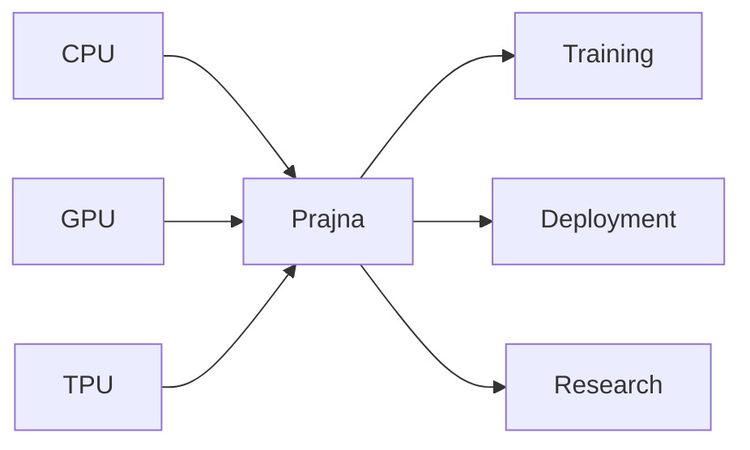
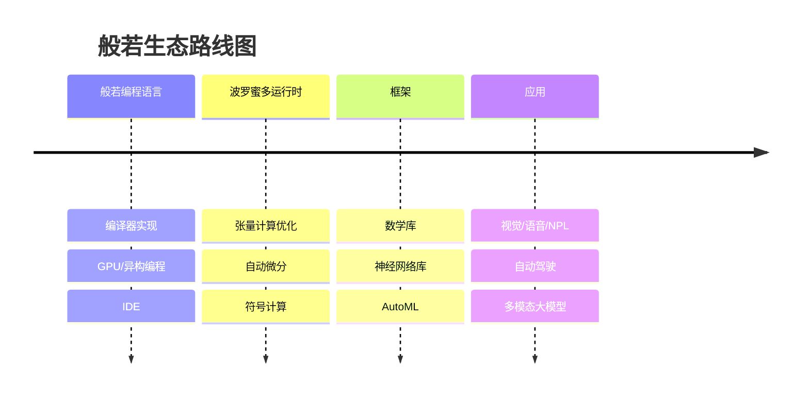
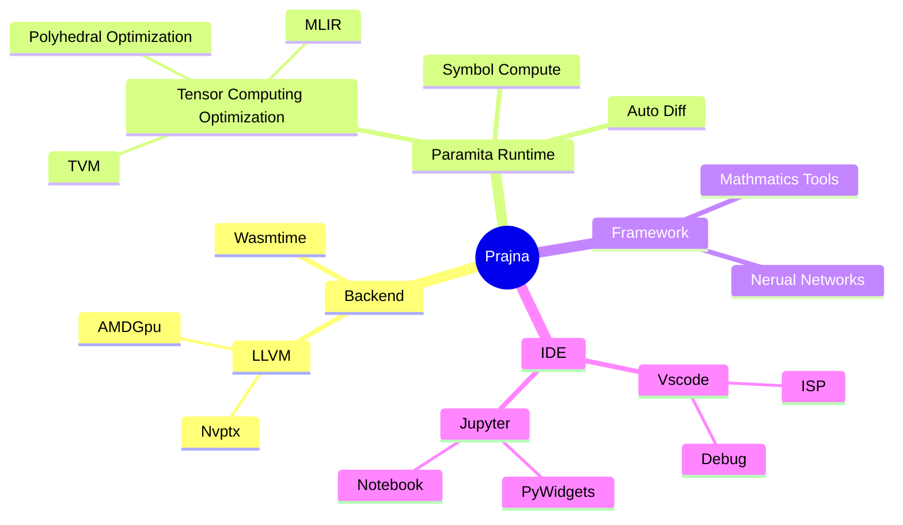

# 般若编程语言

[](https://github.com/ConvolutedDog/prajna/actions/workflows/Remote-Docker-Test.yml)
[](http://dev.matazure.com:8080/blue/organizations/jenkins/prajna/activity)

般若是一门专门为构建更加模块化, 自动化和智能化的人工智能基础设施而研发的开源编程语言. 般若编程语言的目标是同时满足人工智能研究, 训练和部署等多个阶段的使用; 可以简易使用的CPU, GPU和各种TPU为人工智能提供算力.



## 人工智能基础设施现状

目前我们在建设人工智能基础设施时, 需要掌握C++, Python, CUDA和Triton等多门编程语言和技术, 这增加了软件开发的门槛和负担, 使得构建更加稳定和先进的人工智能基础设施尤为困难, 也阻碍了人工智能的进一步发展.

芯片行业研发了多种CPU, GPU, TPU和针对特定领域的加速卡, 这些处理器有着不同的硬件架构和软件生态, 进一步加剧了整个人工智能基础设施的碎片化.

对于人工智能基础设施<strong>研发效率低</strong>和<strong>碎片化严重</strong>的现状, 急需为人工智能基础设施专门设计一门编程语言, 围绕其重构我们的人工智能基础设施. 为此我们设计开发了般若编程语言.

## 般若语言特性

### 即时编译

般若采用即时编译方式,代码即程序, 无需事先编译为二进制可执行程序. 可以直接在X86, Arm和RiscV等各种指令集的芯片上直接运行. 采用LLVM作为后端, 所以会有着和C/C++一样的性能.

### GPU/异构编程

般若将同时提供对CPU, GPU和TPU的编程支持. 目前般若不止提供类似于CUDA的核函数编写, 还提供了gpu for等简单高效的并行编程范式, 会极大低降低异构/并行编程的复杂性. 后期会加大对各种芯片的支持力度

### 张量计算

般若后面会集成类型于MLIR和TVM的张量优化技术, 提供高效, 并行乃至分布式计算的支持. 把张量计算相关的并行计算, 分布式计算的支持放在底层, 会非常有利于后续神经网络等框架的开发.

### 语法改善

般若是属于类C语言, 借鉴了Rust的面向对象的设计, 移除不必要的语法特性, 例如引用等. 内存管理采用比较通用的引用计数.

### 友好交互

般若支持main函数, Repl和Jupyter等多种交互方式, 适合算法研发和部署等多种场景.

## 使用实例

```prjana
use ::gpu::*;
use ::gpu::Tensor<f32, 2> as GpuMatrixf32;

@kernel
@target("nvptx")
func MatrixMultiply(A: GpuMatrixf32, B: GpuMatrixf32, C: GpuMatrixf32) {
    var thread_x = ::gpu::ThreadIndex()[1];
    var thread_y = ::gpu::ThreadIndex()[2];
    var block_x = ::gpu::BlockIndex()[1];
    var block_y = ::gpu::BlockIndex()[2];
    var block_size = 32;
    var global_x = block_x * block_size + thread_x;
    var global_y = block_y * block_size + thread_y;

    var sum = 0.0f32;
    var step = A.Shape()[1] / block_size;
    for i in 0 to step {
        @shared
        var local_a: Array<f32, 1024>;
        @shared
        var local_b: Array<f32, 1024>;
        local_a[thread_x* 32 + thread_y] = A[global_x, thread_y + i * block_size];
        local_b[thread_x* 32 + thread_y] = B[thread_x + i * block_size , global_y];
        ::gpu::BlockSynchronize();

        for j in 0 to 32 {
          sum = sum + local_a[thread_x * 32 + j] * local_b[j * 32 + thread_y];
        }
        ::gpu::BlockSynchronize();
    }

    C[global_x, global_y] = sum;
}

@test
func Main() {
    var block_size = 32;
    var block_shape = [1, block_size, block_size]; // 注意和cuda的dim是相反的顺序, [z, y, x]
    var a_shape = [10 * 32, 10 * 32];
    var b_shape = [10 * 32, 20 * 32];
    var grid_shape = [1, a_shape[0] / block_size, b_shape[1] / block_size];

    var A = GpuMatrixf32::Create(a_shape);
    var B = GpuMatrixf32::Create(b_shape);
    var C = GpuMatrixf32::Create([a_shape[0], b_shape[1]]);

    MatrixMultiply<|grid_shape, block_shape|>(A, B, C);

    var epoch = 300;
    var t0 = chrono::Clock();

    for i in 0 to epoch {
      MatrixMultiply<|grid_shape, block_shape|>(A, B, C);
    }
    gpu::Synchronize(); // 后面会改为更为通用的名字

    var t1 = chrono::Clock();
    t0.PrintLine();
    t1.PrintLine();

    var flops = 2 * a_shape[0] * a_shape[1] * b_shape[1];
    var giga_flops = (flops.Cast<f32>() * 1.0e-9 * epoch.Cast<f32>()) / (t1 - t0);
    giga_flops.Print();
    "GFlop/s".PrintLine();
}
```

可以搜索*.prajna文件查看

## 般若生态路线图

下面是般若及其相关生态的路线图, 作者粗略地分为了下面的四个阶段.



般若编程语言及其相关生态的建设是漫长和困难的. 般若编程语言的设计开发是整个生态的第一步, 也是最重要的一步, 目前已处于完善阶段.

## 般若相关技术

下图是一个般若会涉及到的相关技术思维导图, 重构人工智能基础设施并非把现有的东西全部否定, 恰恰相反现有的相关开源项目依然占据重要位置.
般若社区扮演的更多的是设计,整合和改善的角色. 比如编译的实现, 我们只会去设计编程语言的语法, 而编译器的后端会使用LLVM项目. 而第二阶段的张量计算优化, 我们初期会直接使用MLIR/TVM等项目. 在IDE方面, 我们会增加VSCode和Jupyter的支持. 正是得益于这些开源项目, 般若生态路线图才能稳固快速的推进.



## 般若生态会给人工智能基础设施带来什么样的变化

### 快速迭代, 提升效率

因为研究,训练,部署三个阶段都可以使用Prajna, 我们不需要再把模型从Pytorch中抽离出来, 也不需要把python代码转换为C++代码去部署. 这使得我们的研发,训练和部署流程可以更快的迭代.
Prajna本身改进了C++和Python的很多缺点, 也会使开发效率有所提升.

### 无需适配, 到处运行

不同于Pytorch和Tensorflow在框架层去适配不同的硬件, Prajna会在编译层面去适配各种GPU和TPU. 甚至分布式计算也会由编译器自动处理,
这意味着Prajna的适配工作在编译器阶段就已经完成, 程序可以直接在CPU, GPU, TPU和集群上直接运行.

### 避免碎片化, 使TPU可编程化

目前很多芯片厂商都在以工具链的形式去适配Pytorch, Tensorflow和Jax等框架, 这除了工作量巨大之外还不具备可维护性.
而在般若生态里, 硬件厂商只需要适配类似LLVM的后端即可, 这部分工作本身也是不可避免的.

除此之外, 还能使TPU可编程化, 这也使得我们的TPU能应用到更多场景.

### 人工智能改善基础设施, 基础设施促进人工智能的发展

般若编译器有着非常清晰的模块和层次, 人工智能不止可以生成Prajna的代码, 还可以操作Prajna的中间表示, 选择编译器优化策略等.
这些都直接提升般若生态的能力, 般若生态的提升也会进一步促进人工智能的发展.

### 般若生态的其他影响

般若生态的本质是为算力提供简单高效的使用方式, 很多行业都会因此而受益. 例如:

* 科学计算
* 有限元分析
* 办公统计软件

## 与其他项目比较

### 英伟达的CUDA

CUDA仅支持英伟达自己的GPU, 虽然目前般若也只支持英伟达GPU, 但Prajna后期会加入对其他GPU和TPU的支持.

### OpenAI的Triton

本质上还是Python上的拓展, 无法避免Python本身的弊端, 也不利于自动驾驶, 物联网行业的部署.

### Pytorch/Tensorflow

Pytorch/Tensorflow项目代码过于庞大混乱, 基础架构和框架耦合在一起, 般若生态会着清晰的架构, 在合适的地方处理问题

## 文档

可以查阅[般若编程语言指南](docs/般若编程语言指南.md)来进一步了解.

## 在线体验[](<https://mybinder.org/v2/gh/matazure/prajna-notebooks/HEAD?labpath=%2Fprajna%2Fdocs%2Fnotebooks%2Fhello_world.ipynb>)

点击"launch binder"按钮来快速在线体验般若编程语言.

## docker

还可以直接下载已经安转Prajna的docker来直接体验.

```bash
docker pull matazure/prajna:0.1.0-cpu-ubuntu20.04
docker run -ti matazure/prajna:0.1.0-cpu-ubuntu20.04 prajna repl
```
