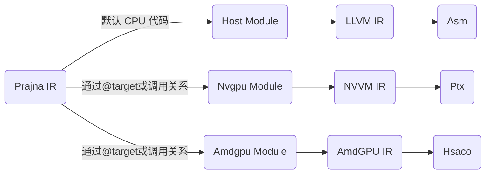
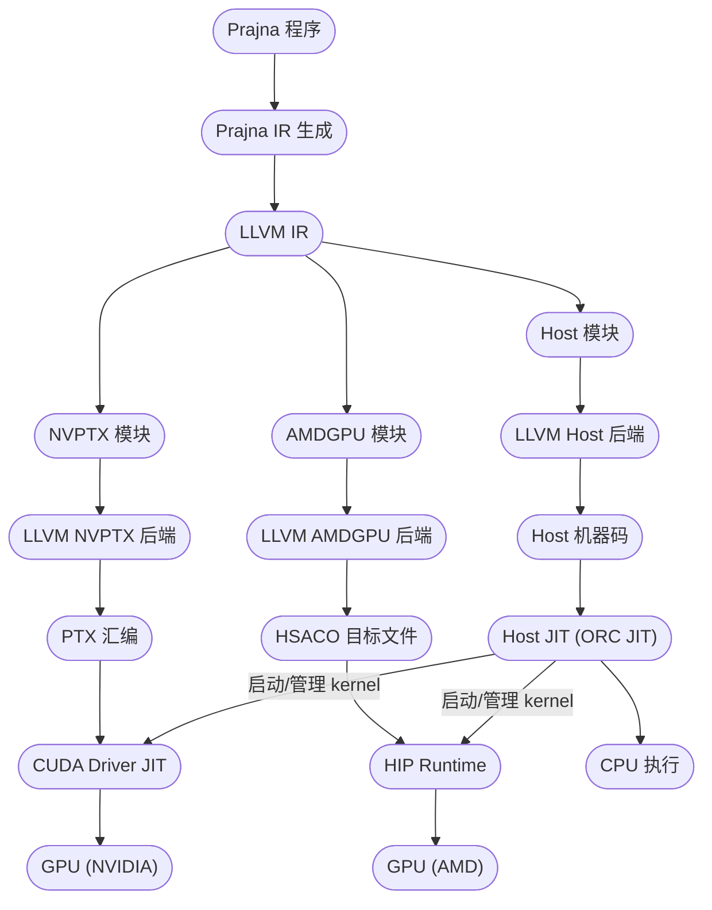
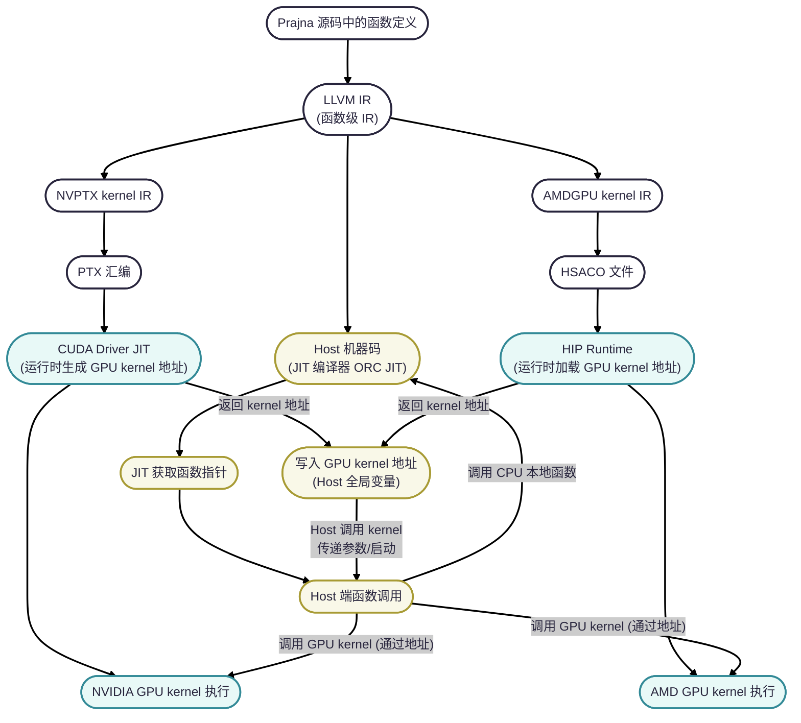

# Prajna 编译器异构 GPU 后端支持实践:NVIDIA & AMD 一站式适配

在 GPU 计算时代，如何让自研的 DSL 语言或编译器高效地跑在 NVIDIA/AMD GPU 上，成为许多开发者关注的问题。Prajna 编译器也不例外，我们在实现过程中选择了 LLVM 的 NVPTX（NVIDIA）和 AMDGPU（AMD）后端，借助其提供的低级汇编能力，实现了对主流 GPU 的灵活支持。本文全面介绍 Prajna 在双后端支持下的实现机制、工程架构、关键代码及平台适配经验。

## Prajna IR的分离

Prajna为了更好地实现编译器, 设计了一套更为上层的IR, 也就是Prajna IR. 我的编译器的主要流程如下图所示


Prajna是一个支持异构计算的编程语言, 和cuda一样, 我们首先要解决的一个首要问题就是多设备的代码分离, Prajna改善了异构编程的流程, 我们可以根据调用的逻辑, 自动把代码发射到对应的平台上, 而不止是根据代码标注来确定.



我们会通过下面的方式进行标注（一般可省略）
>@target 和 @kernel 均可由系统根据调用关系与GPU 原语自动识别；只有在需要固定平台或增强可读性时再显式标注。

```prajna
@target("amdgpu") 
func AmdGpuFun()->void \\ amdgpu平台代码

@target("nvptx")
func NvGpuFun() ->void \\ nvgpu平台代码
```

核函数也可自动识别（@kernel 可省略），需要时可显式写出：

```prajna
@kernel
func Kernel() -> void \\
```

大部分代码无需标注；平台在调用处确定：
```prajna
launch<Kernel, amdgpu|nvgpu>(.....);
```
---

## 什么是 NVPTX / AMDGPU

* **NVPTX（NVIDIA Parallel Thread Execution）** 是 LLVM 的目标后端之一，能够将 LLVM IR 代码编译为 NVIDIA GPU 专用的 PTX 汇编指令。PTX 是一种虚拟指令集，最终由 CUDA 驱动在运行时 JIT 编译为 GPU 机器码。
* **AMDGPU** 则是 LLVM 用于 AMD GPU（ROCm/HIP 生态）的后端，可以将 LLVM IR 编译为 HSACO（HSA Code Object）目标文件，最终被 HIP Runtime 加载并执行于 AMD GPU。

---

## Prajna NVPTX / AMDGPU 实现完整流程

**核心流程图：**



**流程描述：**

1. **Prajna IR 阶段**

   * 用户 Prajna 源码编译为 Prajna IR，自研高阶抽象，包含类型和优化信息。
2. **LLVM IR 阶段**

   * Prajna IR 自动 Lower 到 LLVM IR，充分利用 LLVM 生态。
   * 识别带 kernel 标记的函数，自动拆分 Host 与 Device IR。
3. **后端模块生成**

   * Device 端 IR 进入 NVPTX/AMDGPU 模块，根据目标平台生成规范的 GPU kernel IR。
   * 自动处理目标架构参数，如 NVIDIA 的 `sm_70`/`sm_86`，AMD 的 `gfx906`/`gfx1100` 等。
4. **目标代码生成（LLVM 后端）**

   * 调用 LLVM NVPTX/AMDGPU 后端 API，将 LLVM IR 编译为 PTX（NVIDIA）或 HSACO（AMD）。
   * 全流程自动化，不需要手动调用 llc/clang 等命令行工具。
5. **JIT 与 Kernel 启动**

   * PTX 代码由 CUDA Driver JIT 动态加载，HSACO 文件由 HIP Runtime 加载，自动查找 kernel 地址。
   * Host 端 JIT 环境自动获取 kernel 指针，填充 Host 全局变量，调度逻辑对用户透明。
6. **CPU/GPU 执行**

   * Host 代码通过 ORC JIT 在 CPU 上运行，GPU kernel 通过统一调度接口在指定平台上高效执行。

---

## 关键实现细节与平台 Loader 封装

### 多平台 GPU 标准库设计

* 所有 CUDA/HIP 相关 API、原语、线程索引、内存操作，**都以 DSL 标准库（如 nvgpu.prajna/amdgpu.prajna）方式实现**。
* 类型系统和高阶 API 可以和张量等自定义结构无缝组合，极大提升维护性与可移植性。
* 新增/修改平台特性时，仅需维护标准库源码，而无需更改编译器底层。

---

### 目标代码生成（PTX/HSACO）

#### NVPTX 后端（NVIDIA）

* **目标 triple 配置**：
  `module->setTargetTriple("nvptx64-nvidia-cuda");`
* **TargetMachine 查找与构建**：

  ```cpp
  auto target = llvm::TargetRegistry::lookupTarget(triple, error_msg);
  auto target_machine = target->createTargetMachine(triple, sm_version, "", opts, ...);
  module->setDataLayout(target_machine->createDataLayout());
  ```

* **PTX 汇编生成**：
  使用 legacy PassManager 及 target\_machine->addPassesToEmitFile 输出 PTX 字符串（或文件）。

#### AMDGPU 后端（AMD）

* **目标 triple 配置**：
  `module->setTargetTriple("amdgcn-amd-amdhsa");`
* **TargetMachine 查找与构建**：
  `auto target_machine = target->createTargetMachine(triple, "gfx906", "", opts, ...);`
* **HSACO 目标文件生成**：
  PassManager 驱动输出对象文件，直接写入二进制 HSACO 文件，由 HIP runtime 动态加载。

---

### CUDA Driver Loader 封装（NVIDIA 平台）

**核心思路：**

* 采用单例模式，动态加载 `libcuda.so`。
* 封装 `cuInit`、`cuLibraryLoadFromFile`、`cuLibraryGetKernel` 等函数，自动完成驱动初始化、PTX 加载与 kernel 查找。
* 对用户完全透明，只需通过统一接口即可完成 kernel 动态加载与启动。

**关键代码示例：**

```cpp
class CudaRuntimeLoader {
public:
    static CudaRuntimeLoader& GetInstance() { ... }
    int64_t LoadCudaLibraryFromFile(const std::string& ptx_file) { ... }
    CuLibraryGetKernelFunc* GetCuLibraryGetKernel() { ... }
    // 其余见正文代码
private:
    // 加载及函数指针缓存，初始化逻辑同前
};
```

---

### HIP Runtime Loader 封装（AMD 平台）

**核心思路：**

* 采用单例模式，动态加载 ROCm/HIP runtime 库 `libamdhip64.so`。
* 自动完成 HIP 上下文初始化、HSACO 加载、kernel 查找与调用。
* 所有 API 封装为类方法，内核函数指针、上下文、模块等全部自动管理。

**关键代码示例：**

```cpp
class HipRuntimeLoader {
public:
    static HipRuntimeLoader& Instance() { ... }
    hipFunction_t LoadKernelFunction(const std::string& hsaco_path, const std::string& kernel_name) { ... }
    // 其余见正文代码
private:
    // 动态库指针、上下文初始化、API 绑定等
};
```

---

### JIT 调度与 Host-Device 协作流程



**主流程说明：**

1. Prajna 检查当前 target，自动选择对应 Loader 封装。
2. Host 端代码通过 JIT 动态获取 kernel 函数地址，绑定全局变量，保证 kernel 启动流程透明。
3. 用户所有 kernel 启动、参数传递、同步等流程全部标准化、自动完成，**无需关心 CUDA/HIP API 细节**。
4. 不同平台统一调度接口，后端/平台切换一行代码完成，无需重构业务逻辑。

---


## 使用示例

```prajna
use ::amdgpu as gpu;
// @kernel 可省略，系统可自动识别为 kernel
func myKernel(tensor: gpu::Tensor<i64, 1>) {
  let tid = gpu::ThreadIndex()[0];
  tensor.data[tid] = tid;
}

@test
func TestKernel() {
  let n = 13;
  let grid = [1,1,1];
  let block = [n,1,1];
  let t = gpu::Tensor<i64,1>::Create([n]);

  // AMD 平台
  launch<myKernel, amdgpu>(grid, block, t);
  gpu::Synchronize();

  // NVIDIA 平台
  launch<myKernel, nvgpu>(grid, block, t);
}
```
---

## Prajna 的亮点

* **按调用关系自动判定目标平台**：除显式 `@target` 标注外，Prajna 能根据调用图将函数划归 Host/NVIDIA/AMD 模块，减少手工标注，降低出错率。
* **自动识别 kernel（@kernel @target 可选）与模板化 `launch<kernel, target>` 调用**：平台切换由模板参数显式指定或由上下文推导，调用侧最小改动。
* **LLVM 原生 API 产物生成**：直接通过 LLVM NVPTX/AMDGPU 后端生成 PTX/HSACO，无需依赖外部 `llc/clang`，便于 JIT 与嵌入式场景。
* **双 Loader 封装**：分别适配 CUDA Driver 与 HIP Runtime 的加载、符号解析、启动参数与同步；对上层透明。


## 实战经验与开发建议

* **优先用 LLVM API 自动生成 PTX/HSACO**，效率高、调试友好、方便嵌入式/JIT 场景。
* **Host/Device 函数命名、符号风格要统一**，避免 runtime 查找失败。
* **平台参数（triple、sm、gfx）须明确自动检测，防止编译和兼容性错误。**
* **标准库抽象 GPU API，有助于后续适配更多异构平台。**

---

## 项目链接

* 项目主页：[https://github.com/prajna](https://github.com/prajna)
* 欢迎关注我们的公众号，留言交流你在 GPU 编译和多后端平台实践中的经验与疑问！
