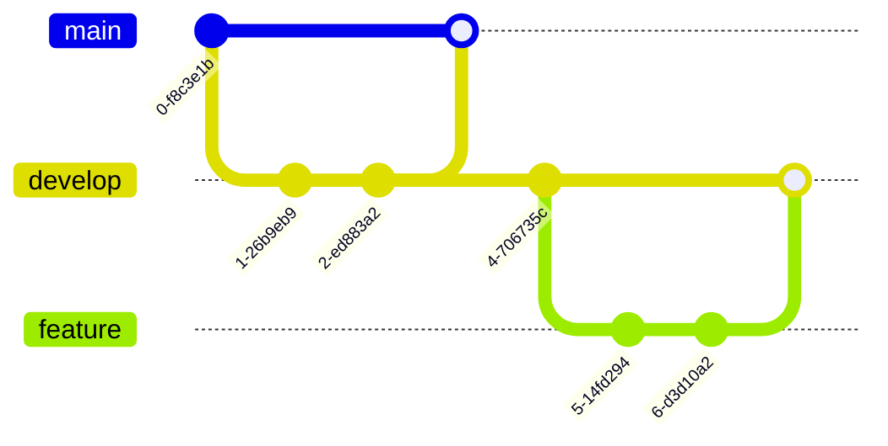

# 般若编程规范

## 开发环境

开发者必须安装和激活下面的插件

* clang-format
* editorconfig

如果你使用的IDE不支持上述插件, 那么推荐使用vscode或者手动执行.

## 代码提交

我们通过github的pullrequest提交代码到仓库里, 提交的代码需要通过本地测试, 集成测试和代码复查后方可合并.
切记向仓库里提交大文件, 二进制文件等.

我们的分支如下所示, 改图主要展示git的使用流程和实际情况有所出入(实际中main和dev都是线性分支)

main分支是我们的主分支, main分支的当前节点应该是一个发行节点.

dev分支是我们的开发分支, 合格的提交会合并到dev中. 我们验证dev分支的发行节点后方可合入main分支.

我们合并分支时需要遵行这些原则

* 一个功能一个commit, 这意味着多个commit的feature分支需要squash的方式合并.
* 相关性不大的提交不要放在一个commit里.
* commit的信息需要有意义.
* 确保main分支和dev分支都是线性的, 在github里, 我们仅启用"Allow rebase merging
* main和dev都是保护分支, 原则上不可强制回撤.(在错误提交大文件的情况下还是需要强制回撤的)

## 第三库组织

我们直接使用submodule来加入第三方库依赖, 加入时注意应该使用https连接而不是ssh连接. 原则上不加入github外的第三方库和私有库.
使用cmake的add_subdirectoy来组织依赖, 注意cmake的编写需要遵循[Effective Modern CMake](https://gist.github.com/mbinna/c61dbb39bca0e4fb7d1f73b0d66a4fd1)规范.

## 代码规范

我们的代码规范遵循.clang-format的设定, 和一些常见的编程原则.

下列场景是需要特别注意的或者和一些常见的原则不一样的

### 引用的使用

* 原则上不返回引用
* 原则上在lambda表达式不捕获this指针.
* 在非必要情况下, 在lambda表达式里不捕获引用.

如果违反上述情况, 需要确定不存在任何内存问题.

### 不提倡使用const修饰关键字

除了类似"const string& str"这类的参数修饰外, 不提倡使用const关键字修饰, 因为没有必要且不好统一

### 如果字段需要读取, 那么直接把字段设置为public即可, 不要去实现get/set函数

### 切勿使用返回值来判断程序是否正确执行

* 尽量使用断言在关键位置来确保逻辑的正确
* 如果程序的确存在需要跳出的失败场景, 则使用异常记录信息后直接跳出, 且在合适的位置捕获

一个函数的返回值必须和函数的实际意义相对应, 不应该挪作他用

### 尽量减少重载函数的使用, 可以使用不同名字来区分他们

### 尽量减少默认参数的使用

### 不要传递引用参数到函数了, 如果需要改变参数可以使用指针

### 如果函数需要返回多个值, 可以使用tuple结构体

### 变量命名规则

std::vector, std::list, std::map等数据结构可在后面加后缀, std::list的后缀可以省略

## 测试

增加新的功能都需要进行测试. 测试应尽可能自动化, 并加入到我们的CI里去.

### 单元测试

目前我们是用googletest测试框架

### 集成测试

我们采用Jenkins作为我们的集成测试框架, 原则上外部开发者不能修改Jenkinsfile, 且需要仔细核查修改.

### 文档

我们使用markdown来书写文档, 使用mermaid来绘制文档里的UML.
