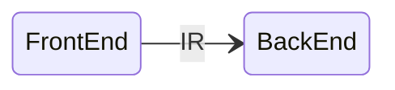
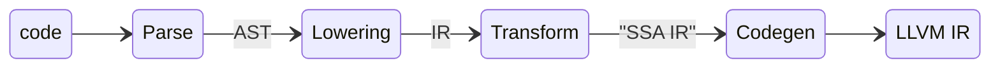

# 般若编译器架构

## 主要组件

目前一般编译器主要有前端和后端构成.



编译器的前端主要负责代码的解析, 后端主要负责代码的优化和机器码的生成. 而是是通过中间表示(IR)连续到一块的, 前端会生成后端所以中间表示. 般若编译器主要使用LLVM作为其后端, 我们的主要工作都是集中在编译器的前端上. 下图对应的是般若编译器前端的主要流程, 其将"代码"最终演变为了"中间表示", 有"Parse", "Lowering", "Transform", "Codegen"四个过程. 这四个过程和我们编译器实现的代码结构是完全对应的.



## 中间表示

般若会设计自己的中间表示, 不同于LLVM的中间表示, 般若中间表示刚开始会更接近高级语言, 然后再向下逐步装换为接近SSA形式并最终生成LLVM中间表示.
这也是我们为什么要自己设计般若中间表示, 因为LLVM中间表示里高级语言还是比较远的, 并不适合直接生成. 般若中间表示和LLVM中间表示一样, 主要结构是"值", 值都会有一个"类型"字段.

下面便是一些主要类图. 我们会简化一些不必要的东西以更好的表达结构关系, 例如省略std::shared_ptr等. 类图主要为了说明一些关系, 并不会特别完整和准确. 为了UML图的显示, 需要在vscode里安装mermaid和plantuml插件.

```plantuml
class Type <<type>>

class PrimitiveType <<type>>
Type <|-- PrimitiveType

class PointerType {
    value_type: Type;
}
PointerType::value_type o--> Type

class StructType <<type>> {
    namedTypes: map<string, Type>;
}
Type <|-- StructType
StructType::namedTypes o--> Type

class PointerType <<type>>{

}
Type <|-- PointerType

class FunctionType <<Type>> {
    return_type : Type;
    argumentTypes : vector<Type>;
}
Type <|-- FunctionType
FunctionType::return_type o--> Type

class TensorType <<type>> {
    value_type : Type;
}
Type <|-- TensorType
TensorType::value_type o--> Type

```

```plantuml

' region value
together {

class Value <<value>> {
    type : Type
}
Value o-right---> Type
' Type <--o Value::type
' Value -- Type
' Type <--o Value::type

' Constant
together {

class Constant <<value>> {
    type: Type;
    variant<i32, int64, bool, ...> value;
}
' Constant::type o-- Type

class ConstantStruct <<value>>  {
}

Constant <|-- ConstantStruct

}

Value <|-- Constant
Value <|-- Function

class Function <<value>> {
    type : FunctionType
}
' Function::type o--> FunctionType

class LocalVariable <<value>> {
    type: Type;
}
Value <|-- LocalVariable
' LocalVariable::type o-[hidden]-> Type

class DeferencePointer <<value>> {}
Value <|-- DeferencePointer

class Field <<value>> {
    object : Value;
    type : Type;
    name : string;
}
Value <|-- Field
' Field::object o--> Value

together {

class Instruction <<value>> {}
Value <|-- Instruction

Instruction <|-- StorePointer
Instruction <|-- LoadPointer
Instruction <|-- CallFunction

class CallFunction <<value>> {
    arguments: vector<Value>;
    function: Function;
}
' CallFunction::function o--> Function
' CallFunction::arguments o--> Value

class LoadPointer <<value>> {
    pointer: value;
}
class StorePointer <<value>> {
    pointer: Value;
    value: Value;
}
LoadPointer -[hidden] StorePointer

' LoadPointer::pointer o--> Value
' StorePointer::pointer o--> Value
' StorePointer::value o--> Value

}

together {

class Tensor <<value>> {
    type : TensorType;
}
' Value <|-- Tensor
Tensor --|> Value
' Tensor::type o--> TensorType


' Tensor -- TensorAccess

}


class Block <<value>> {}
Value <|-- Block

class ForBlock <<value>> {
    space:  Region<int, _Dim>
    variable: Array<string, _Dim>
}

Block <|-- ForBlock

}

```

## 名字空间

名字空间虽然没有直接出现在语法里, 但其在编程中是广泛存在的, module会有自己的名字空间, 在"{}"代码块里, 也会产生临时的名字空间.

### 符号

在般若里符号是用于名字空间的索引的, 只要有"名字"且需要查找的, 我们大部分都认为其是一个符号.

```plantuml

class SymbolTable <<symbol>> {
    bool has(id : string);
    Symbol get(id : string);
}

SymbolTable o-left-> Symbol

class InterfacePrototype
Symbol <|-- InterfacePrototype
Symbol <|-- Template
Symbol <|-- TemplateStruct
Symbol <|-- ConstantInt
Symbol <|-- SymbolTable


' class Template<StructType> <<symbol>>{

' }

' Symbol <|-- Template<StructType>

class Symbol <<symbol>> {}

class Module <<symbol>> {}

class InterfacePrototype <<symbol>> {}

class Value <<value>>
class Type <<type>>

Symbol <|-- Value
Symbol <|-- Type
Symbol <|-- Module

```
